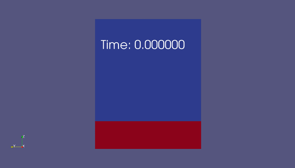
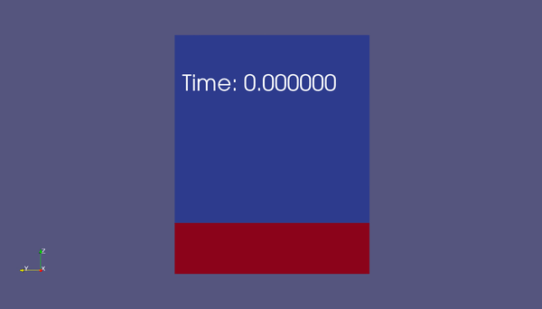
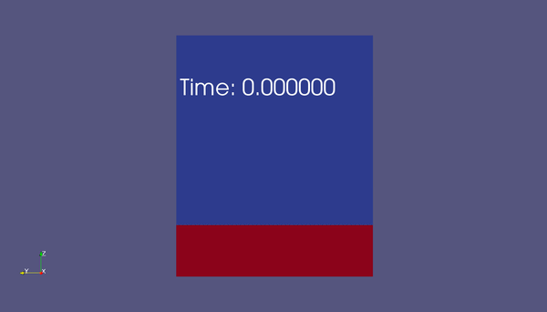
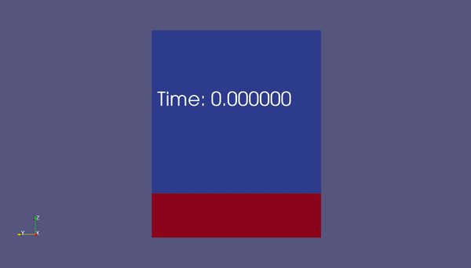

# ML_Sloshing_Characterization
  Supplementary material for the manuscript titled "A Machine Learning-based Characterization Framework for Parametric Representation of Nonlinear Sloshing", authored by Xihaier Luo, Ahsan Kareem, Liting Yu, and Shinjae Yoo.

## Abstract

  The growing interest in creating a parametric representation of liquid sloshing inside a container stems from its practical applications in modern engineering systems. The resonant excitation, on the other hand, can cause unstable and nonlinear water waves, resulting in chaotic motions and non-Gaussian signals. This paper presents a novel machine learning-based framework for nonlinear liquid sloshing representation learning. The proposed method is a parametric modeling technique that is based on sequential learning and sparse regularization. The dynamics are categorized into two parts: linear evolution and nonlinear forcing. The former advances the dynamical system in time on an embedded manifold, while the latter causes divergent behaviors in temporal evolution, such as bursting and switching. The proposed framework's merit is demonstrated using an experimental dataset of liquid sloshing in a tank under horizontal excitation with a wide frequency range and various vertical slat screen settings.

## CFD Simulation
We performed computational fluid dynamics simulations of liquid sloshing in a small tank with a middle water depth to better understand the nonlinear properties of water sloshing. Using experimental results, we are now validating the numerical model for simulation. Here's a look at what we have right now.

<figcaption>MDN Logo</figcaption>

 

